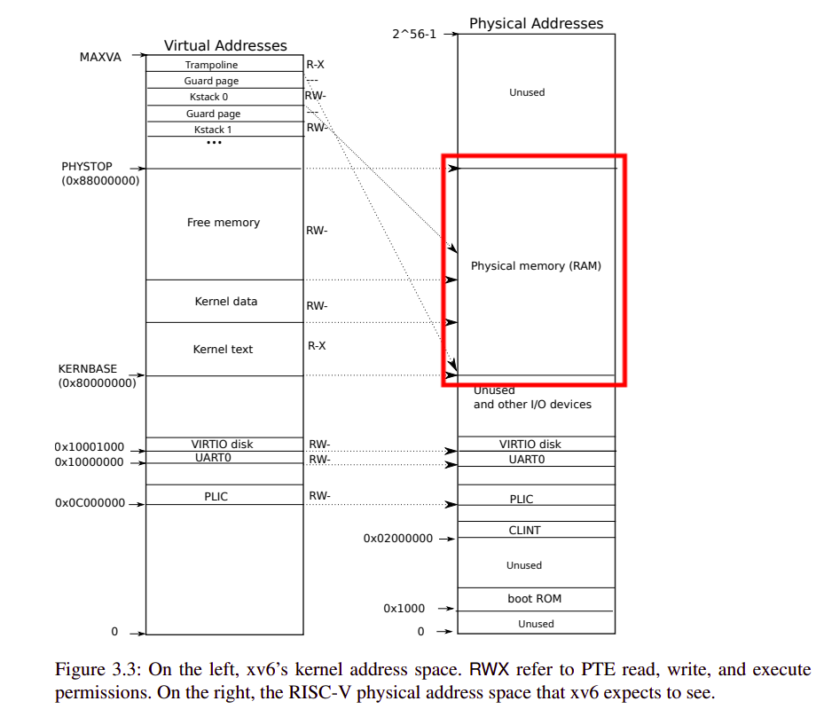
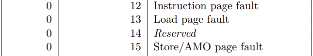

# Lab5: Copy-on-Write Fork for xv6

:penguin: **ALL ASSIGNMENTS HAVE PASSED THE TESTS** :white_check_mark:

- [x] [Implement copy-on-write fork(hard)](#implement-copy-on-write-forkhard)

Virtual memory provides a level of indirection: the kernel can intercept memory references by marking PTEs invalid or read-only, leading to page faults, and can change what addresses mean by modifying PTEs. There is a saying in computer systems that any systems problem can be solved with a level of indirection. This lab explores an example: copy-on-write fork.

## [Implement copy-on-write fork(hard)](#lab5-copy-on-write-fork-for-xv6)

According to the definition of copy-on-write, we need to use a reserved bit to indicate COW page. Modify _kernel/riscv.h_ to write your own PTE bit alias.

### _kernel/riscv.h_

```c
#define PTE_COW (1L <<  8) // user defined PTE copy-on-write bit
```

Another creation is a new structure type used for COW page reference count record. _plan 3_ notes that

> _For example, you could index the array with the page's physical address divided by 4096, and give the array a number of elements equal to highest physical address of any page placed on the free list by kinit() in kalloc.c_



Therefore, the physical memory range from `KERNBASE` to `PHYSTOP` is the user available region. In addition, `PGSIZE` actually equals to 4096 in xv6. It's naturally to use an array whose size is `(PHYSTOP - KERNBASE) / PGSIZE` to record the essential information. However, taking concurrency into account, we need to add a spinlock to protect this array because multiple processes will lead to race condition.

`kalloc()` needs to initialize the reference count to 1. `kfree()` performs a bit different. Only when the reference count equals to one, can we recycle this page, throwing it to `freelist`. `refinc()` is a user defined function used to increase the reference count.Declaration is needed in _kernel/defs.h_ for further usage in `uvmcopy()`.

### _kernel/kalloc.c_

```c
struct {
  struct spinlock lock;
  int refcount[(PHYSTOP - KERNBASE) / PGSIZE];
} pgbk; // page book-keeping used to record the page reference


void
refinc(void *pa) {
  int idx = ((uint64)pa - KERNBASE) / PGSIZE;
  
  acquire(&pgbk.lock);
  pgbk.refcount[idx]++;
  release(&pgbk.lock);
}

// Free the page of physical memory pointed at by pa,
// which normally should have been returned by a
// call to kalloc().  (The exception is when
// initializing the allocator; see kinit above.)
void
kfree(void *pa)
{
  struct run *r;

  if(((uint64)pa % PGSIZE) != 0 || (char*)pa < end || (uint64)pa >= PHYSTOP)
    panic("kfree");

  /* update reference count */
  int idx = ((uint64)pa - KERNBASE) / PGSIZE;
  /* lock can prevent concurrency race condition */
  acquire(&pgbk.lock);
  if (pgbk.refcount[idx] > 1) {
    pgbk.refcount[idx]--;
    release(&pgbk.lock);
  }
  else {
    pgbk.refcount[idx] = 0; // Not redundant!!! Consider initialization
    release(&pgbk.lock);

    // Fill with junk to catch dangling refs.
    memset(pa, 1, PGSIZE);

    /* recycle memory only when refcount equals to 0 */
    r = (struct run*)pa;

    acquire(&kmem.lock);
    r->next = kmem.freelist;
    kmem.freelist = r;
    release(&kmem.lock);
  }

}

// Allocate one 4096-byte page of physical memory.
// Returns a pointer that the kernel can use.
// Returns 0 if the memory cannot be allocated.
void *
kalloc(void)
{
  struct run *r;

  acquire(&kmem.lock);
  r = kmem.freelist;
  if(r)
    kmem.freelist = r->next;
  release(&kmem.lock);

  if (r) {
    /* update reference count */
    int idx = ((uint64)r - KERNBASE) / PGSIZE;
    /* lock can prevent concurrency race condition */
    acquire(&pgbk.lock);
    pgbk.refcount[idx] = 1;
    release(&pgbk.lock);
  }

  if(r)
    memset((char*)r, 5, PGSIZE); // fill with junk
  return (void*)r;
}
```

### _kernel/vm.c_

_plan 1_ asks to modify the `uvmcopy()` function, that we only need to map the parent's physical pages into the child, instead of allocating new pages. Don't forget to clear `PTE_W` and set `PTE_COW` before mapping. Also you need to increase the reference count on account of new child mapping.

Don't forget any error checking like `pte == 0`, etc. Otherwise, the `kerneltrap` panic will occur. `copyout()` acts like `usertrap()`, so I will explain details in next session.

```c
// Given a parent process's page table, copy
// its memory into a child's page table.
// Copies both the page table and the
// physical memory.
// returns 0 on success, -1 on failure.
// frees any allocated pages on failure.
int
uvmcopy(pagetable_t old, pagetable_t new, uint64 sz)
{
  pte_t *pte;
  uint64 pa, i;
  uint flags;

  for(i = 0; i < sz; i += PGSIZE){
    if((pte = walk(old, i, 0)) == 0)
      panic("uvmcopy: pte should exist");
    if((*pte & PTE_V) == 0)
      panic("uvmcopy: page not present");
    pa = PTE2PA(*pte);
    // clear PTE_W and mark COW for both parent and child
    *pte &= ~PTE_W;
    *pte |= PTE_COW;
    flags = PTE_FLAGS(*pte);
    // map parent's physical page into child
    if(mappages(new, i, PGSIZE, (uint64)pa, flags) != 0){
      goto err;
    }
    refinc((void *)pa);
  }
  return 0;

 err:
  uvmunmap(new, 0, i / PGSIZE, 1);
  return -1;
}

// Copy from kernel to user.
// Copy len bytes from src to virtual address dstva in a given page table.
// Return 0 on success, -1 on error.
int
copyout(pagetable_t pagetable, uint64 dstva, char *src, uint64 len)
{
  uint64 n, va0, pa0;
  pte_t *pte;
  char *np;
  uint flags;

  while(len > 0){
    va0 = PGROUNDDOWN(dstva);

    if(va0 >= MAXVA) {
      return -1;
    }

    pte = walk(pagetable, va0, 0); // walkaddr() has checked all condition
    if(pte == 0 || ((*pte) & PTE_V) == 0 || ((*pte) & PTE_U) == 0) {
      return -1;
    }

    if ((pa0 = PTE2PA(*pte)) == 0) {
      return -1;
    }
    flags = PTE_FLAGS(*pte);
    if ((flags & PTE_COW) == PTE_COW) {
      if ((np = kalloc()) == 0) {
        return -1;
      }
      memmove(np, (char*)pa0, PGSIZE);
      flags |= PTE_W;
      flags &= ~PTE_COW;
      *pte &= ~PTE_V; // avoid remap
      if (mappages(pagetable, va0, PGSIZE, (uint64)np, flags) != 0) {
        kfree((void *)np);
        return -1;
      }
      kfree((void*) pa0);
    }

    pa0 = walkaddr(pagetable, va0);
    if (pa0 == 0) {
      return -1;
    }

    n = PGSIZE - (dstva - va0);
    if(n > len)
      n = len;
    memmove((void *)(pa0 + (dstva - va0)), src, n);

    len -= n;
    src += n;
    dstva = va0 + PGSIZE;
  }
  return 0;
}
```

### _kernel/trap.c_

Toughest part of this assignment!



- `stval` register stores the virtual address. When
a trap is taken into S-mode, `stval` is written with exception-specific information to assist software
in handling the trap.

- `scause`. When a trap is taken into S-mode, scause is written with a code indicating the event that caused the trap. There are three types of page fault, **Instruction page fault**, **Load page fault**, **Store/AMO page fault**. Obviously the latter two page fault may arise from COW if you have read the text book.

> If you are not sure, `usertests` will tell you. (`sbrk` related tests cause error with `scause=0x0d` if `r_scause() == 13` ignored).

- This check is critical. `usertests` has an `textwrite` test, who write data to physical address 0, where is the `text` region located at. We know `text` region cannot be written anything!!!

    ```c
    if(va < PGSIZE) {
      // If you write text session, quit!
      setkilled(p);
      goto out;
    }
    ```

- `(*pte) &= ~PTE_V;` is necessary. Otherwise, you will get `panic remap`.

- `kfree((void*)pa);` is necessary. Old page release can prevent memory leak when a new page memory allocated. Except for this, in COW, reference count decrease also needs this operation. You can image a scenario that a process calls `fork()`, the parent and the child initially points to the same page.

    > You can understand what `kfree` acts with the assistance of the flowchart.

    ```mermaid
    ---
    title: COW
    ---
    flowchart TB
        id1_1(parent)
        id1_2(child)
        id1_3(page0)
        id2_1(parent)
        id2_2(child)
        id2_3(page0)
        id2_4(page1)
        id3_1(parent)
        id3_2(child)
        id3_3(page0)
        id3_4(page1)
        id3_5(page2)
        style id1_3 fill:#fff,stroke-width:4px
        style id2_3 fill:#fff,stroke-width:4px
        style id2_4 fill:#02F,stroke-width:4px
        style id3_3 fill:#f00,stroke-width:4px
        style id3_4 fill:#02F,stroke-width:4px
        style id3_5 fill:#02F,stroke-width:4px
        subgraph stage3
        id3_1 --> id3_4
        id3_3
        id3_2 --> id3_5
        end
        subgraph stage2
        id2_1 --> id2_3
        id2_2 --> id2_4
        end
        subgraph stage1
        id1_1 --> id1_3
        id1_2 --> id1_3
        end
    ```

```c
void
usertrap(void)
{
    ...
    else if (r_scause() == 13 /* load page fault */ || 
            r_scause() == 15 /* store page fault */) {
    uint64 pa;
    uint flags;
    char *np;
    uint64 va = PGROUNDDOWN(r_stval());

    if (va >= MAXVA) {
      setkilled(p);
      goto out;
    }

    if(va < PGSIZE) {
      // If you write text session, quit!
      setkilled(p);
      goto out;
    }

    pte_t *pte = walk(p->pagetable, va, 0);
    if (pte == 0 || ((*pte) & PTE_V) == 0 || ((*pte) & PTE_U) == 0) {
      setkilled(p);
      goto out;
    } // page should exist

    flags = PTE_FLAGS(*pte);
    if ((flags & PTE_COW) == PTE_COW) {
      if ((np = kalloc()) == 0) {
        setkilled(p);
        goto out;
      } // no free memory
      if ((pa = PTE2PA(*pte)) == 0) {
        setkilled(p);
        goto out;
      }
      memmove(np, (char*)pa, PGSIZE); // copy data
      flags |= PTE_W;
      flags &= ~PTE_COW; // clear PTE_COW bit
      (*pte) &= ~PTE_V;
      if (mappages(p->pagetable, va, PGSIZE, (uint64)np, flags) != 0) {
        kfree((void *)np);
        setkilled(p);
        goto out;
      }
      kfree((void*)pa);
    }
  } else {
    printf("usertrap(): unexpected scause %p pid=%d\n", r_scause(), p->pid);
    printf("            sepc=%p stval=%p\n", r_sepc(), r_stval());
    setkilled(p);
  }

out:
  if(killed(p))
    exit(-1);
  ...
}
```
