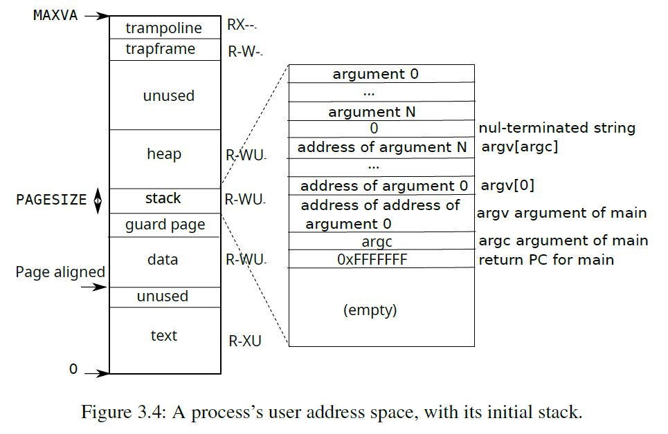

# Lab10: mmap

:penguin: **ALL ASSIGNMENTS HAVE PASSED THE TESTS** :white_check_mark:

The _mmap_ and _munmap_ system calls allow UNIX programs to exert detailed control over their address spaces. They can be used to share memory among processes, to map files into process address spaces, and as part of user-level page fault schemes such as the garbage-collection algorithms discussed in lecture. In this lab you'll add _mmap_ and _munmap_ to xv6, focusing on memory-mapped files.

## Your Job(hard)

### _kernel/proc.h_

```c
#define NVMA        (16)

struct vma {
  int valid;      // 0 valid, 1 invalid
  uint64 addr;    // Virtual address at which to map the file
  int length;     // Number of bytes to map, 0 mean invalid map
  int prot;       // Permission: PROT_READ or PROT_WRITE or both
  int flags;      // MAP_SHARED(meaning that modifications to the mapped memory 
                  // should be written back to the file) or MAP_PRIVATE(should not)
  int off;        // offset
  struct file* f; // file descriptor
};

...

// Per-process state
struct proc {
  ...
  struct vma vma[NVMA];        // Virtual memory areas
}
```

### _kernel/sysfile.c_

Add `sys_mmap` and `sys_munmap` system calls. We need to design a memory mapping strategy that doesn't conflict with other user space address. We can map the **VMA(Virtual Memory Area)** from top of the process user address space.

So we define `vaend = MAXVA - 2 * PGSIZE` to avoid override of pages **trampoline** and **trapframe**. The down-growth mapping area has low probability to encounter with the up-growth heap.

For convenience, I always map the areas starting from aligned address with the integer multiple of the pages.



```c
uint64
sys_mmap(void)
{
  uint64 addr;
  int length, prot, flags, fd, offset, i;
  struct file *f;

  argaddr(0, &addr);
  argint(1, &length);
  argint(2, &prot);
  argint(3, &flags);
  argfd(4, &fd, &f);
  argint(5, &offset);
  
  if (length == 0) {
    return -1;
  }

  // Conflict check
  if ((!f->readable && (prot & PROT_READ)) ||
      ((!f->writable) && (prot & PROT_WRITE) && !(flags & MAP_PRIVATE))) {
    return -1;
  }

  length = PGROUNDUP(length);

  uint64 vaend = MAXVA - 2 * PGSIZE;
  // Find a free vma, and calculate where to map the file along the way.
  // We map from high to low.
  struct proc *p = myproc();
  for (i = 0; i < NVMA; i++) {
    /* Find a free slot for mapping */
    struct vma *vv = &p->vma[i];
    if (vv->valid == 0) {
      break;
    }
    else if(vv->addr < vaend) {
      vaend = PGROUNDDOWN(vv->addr);
    }
  }

  if (i == NVMA) {
    panic("syscall mmap");
  }

  struct vma *v = &p->vma[i];
  v->valid  = 1;
  v->addr   = vaend - length;
  v->length = length;
  v->prot   = prot;
  v->flags  = flags;
  v->f      = f;
  v->off    = offset;
  filedup(v->f);  //increase the ref of the file

  return v->addr;
}

uint64
sys_munmap(void)
{

  uint64 addr;
  int length;

  argaddr(0, &addr);
  argint(1, &length);

  if (length == 0) {
    return -1;
  }

  addr = PGROUNDDOWN(addr);
  length = PGROUNDUP(length);

  struct proc *p = myproc();
  struct vma *v = 0;
  for (int i = 0; i < NVMA; i++) {
    struct vma *vv = &p->vma[i];
    if (vv->valid == 1 && addr >= vv->addr && addr < vv->addr + vv->length) {
      v = vv;
    }
  }
  if (v == 0) {
    return -1;
  }

  if(addr > v->addr && addr + length < v->addr + v->length) {
    return -1; // hole
  }

  if (addr != v->addr) {
    return -1;
  }

  v->addr += length;
  v->length -= length;
  if(v->flags & MAP_SHARED) {
    filewrite(v->f, addr, length);
  }
  uvmunmap(p->pagetable, addr, length / PGSIZE, 1);

  if(v->length <= 0) {
    fileclose(v->f);
    v->valid = 0;
  }

  return 0;
}

int 
vmalazy(uint64 va) {
  struct proc *p = myproc();
  // search the suitable vma slot
  struct vma *v = 0;
  for (int i = 0; i < NVMA; i++) {
    struct vma *vv = &p->vma[i];
    if (vv->valid == 1 && va >= vv->addr && va < vv->addr + vv->length) {
      v = vv;
    }
  }
  if (v == 0)
    return -1;

  // allocate physical page
  void *pa = kalloc();
  if(pa == 0) {
    panic("usertrap(): kalloc");
  }
  memset(pa, 0, PGSIZE);

  begin_op();
  ilock(v->f->ip);
  readi(v->f->ip, 0, (uint64)pa, v->off + PGROUNDDOWN(va - v->addr), PGSIZE); //copy a page of the file from the disk
  iunlock(v->f->ip);
  end_op();

  if(mappages(p->pagetable, va, PGSIZE, (uint64)pa, PTE_U | (v->prot << 1)) < 0) {
    panic("pagefault map error");
  }

  return 0;
}
```

### _kernel/trap.c_

We use lazy allocation strategy to manage the memory. Only when we need the page, will the page fault call `vmalazy` function to read data according to file inode from the cache buffer or the disk. After that, we build page mapping from virtual memory to physical memory.

```c
void
usertrap(void)
{
    ...
    else if ((r_scause() == 13 || r_scause() == 15)) {
    // lazy allocation
    uint64 va = r_stval();
    if (vmalazy(va) < 0) {
      goto out;
    }
  }
  else {
out:
    printf("usertrap(): unexpected scause %p pid=%d\n", r_scause(), p->pid);
    printf("            sepc=%p stval=%p\n", r_sepc(), r_stval());
    setkilled(p);
  }
  ...
}
```

### _kernel/vm.c_

```c
// Remove npages of mappings starting from va. va must be
// page-aligned. The mappings must exist.
// Optionally free the physical memory.
void
uvmunmap(pagetable_t pagetable, uint64 va, uint64 npages, int do_free)
{
  uint64 a;
  pte_t *pte;

  if((va % PGSIZE) != 0)
    panic("uvmunmap: not aligned");

  for(a = va; a < va + npages*PGSIZE; a += PGSIZE){
    if((pte = walk(pagetable, a, 0)) == 0)
      panic("uvmunmap: walk");
    if((*pte & PTE_V) == 0)
      // panic("uvmunmap: not mapped");
      continue;
    ...
  }
}

// Given a parent process's page table, copy
// its memory into a child's page table.
// Copies both the page table and the
// physical memory.
// returns 0 on success, -1 on failure.
// frees any allocated pages on failure.
int
uvmcopy(pagetable_t old, pagetable_t new, uint64 sz)
{
  pte_t *pte;
  uint64 pa, i;
  uint flags;
  char *mem;

  for(i = 0; i < sz; i += PGSIZE){
    if((pte = walk(old, i, 0)) == 0)
      panic("uvmcopy: pte should exist");
    if((*pte & PTE_V) == 0)
      // panic("uvmcopy: page not present");
      continue;
    ...
  }
  return 0;

 err:
  uvmunmap(new, 0, i / PGSIZE, 1);
  return -1;
}
```

### _kernel/proc.c_

```c
static struct proc*
allocproc(void)
{
  ...
  for(int i = 0;i < NVMA; i++) {
    p->vma[i].valid = 0;
  }

  return p;
}


// Create a new process, copying the parent.
// Sets up child kernel stack to return as if from fork() system call.
int
fork(void)
{
  ...
  acquire(&np->lock);
  np->state = RUNNABLE;
  // copy vmas created by mmap.
  // actual memory page as well as pte will not be copied over.
  for(int i=0; i < NVMA; i++) {
    memmove(&np->vma[i], &p->vma[i], sizeof(p->vma[i]));
    if(p->vma[i].f)
      filedup(p->vma[i].f);
  }
  release(&np->lock);


  return pid;
}

// Exit the current process.  Does not return.
// An exited process remains in the zombie state
// until its parent calls wait().
void
exit(int status)
{
  struct proc *p = myproc();

  if(p == initproc)
    panic("init exiting");

  // Close all open files.
  for(int fd = 0; fd < NOFILE; fd++){
    if(p->ofile[fd]){
      struct file *f = p->ofile[fd];
      fileclose(f);
      p->ofile[fd] = 0;
    }
  }

  for(int i=0; i < NVMA; i++) {
    uvmunmap(p->pagetable, p->vma[i].addr, p->vma[i].length / PGSIZE, 1);
  }
  ...
}
```

### _kernel/syscall.h_

```c
...
#define SYS_mmap   22
#define SYS_munmap 23
```

### _kernel/syscall.c_

```c
...
extern uint64 sys_mmap(void);
extern uint64 sys_munmap(void);

static uint64 (*syscalls[])(void) = {
...
[SYS_mmap]    sys_mmap,
[SYS_munmap]  sys_munmap,
}
```

### _kernel/riscv.h_

```c
#define PTE_D (1L << 7) // dirty
```

### _user/user.h_

```c
void *mmap(void *, int, int, int, int, int);
int munmap(void *, int);
```

### _user/usys.pl_

```pl
entry("mmap");
entry("munmap");
```
